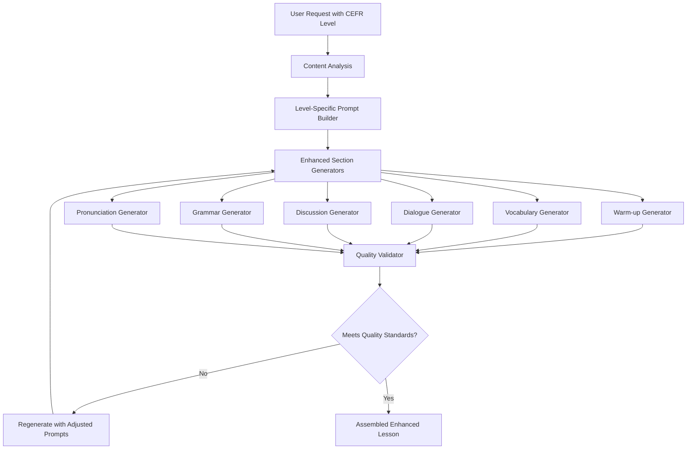

# Design Document: Enhanced AI Lesson Generation Quality

## Overview

This feature enhances the pedagogical quality and effectiveness of AI-generated lesson sections in LinguaSpark. The design focuses on improving six key lesson components: warm-up questions, vocabulary examples, dialogue sections, discussion questions, grammar focus, and pronunciation practice. Each enhancement is tailored to CEFR levels (A1-C1) to ensure appropriate difficulty and learning outcomes. The improvements maintain the AI-first approach while implementing specific prompt engineering strategies and validation rules to ensure consistent, high-quality output that serves language tutors and their students effectively.

## Architecture

### High-Level Architecture



### System Components

1. **Level-Specific Prompt Builder**: Constructs prompts tailored to each CEFR level with specific complexity requirements
2. **Enhanced Section Generators**: Specialized generators for each lesson component with quality rules
3. **Quality Validator**: Validates output against requirements (count, complexity, appropriateness)
4. **Pedagogical Rule Engine**: Enforces teaching best practices in generated content
5. **Content Complexity Analyzer**: Ensures vocabulary and structures match CEFR level

## Components and Interfaces

### 1. Level-Specific Prompt Builder

**Purpose**: Constructs AI prompts with CEFR-appropriate complexity and quantity specifications

```typescript
interface LevelSpecificPromptBuilder {
  buildWarmupPrompt(content: string, level: CEFRLevel): EnhancedPrompt;
  buildVocabularyPrompt(content: string, level: CEFRLevel): EnhancedPrompt;
  buildDialoguePrompt(content: string, level: CEFRLevel): EnhancedPrompt;
  buildDiscussionPrompt(content: string, level: CEFRLevel): EnhancedPrompt;
  buildGrammarPrompt(content: string, level: CEFRLevel): EnhancedPrompt;
  buildPronunciationPrompt(content: string, level: CEFRLevel): EnhancedPrompt;
}

interface EnhancedPrompt {
  systemPrompt: string;
  userPrompt: string;
  qualityRules: QualityRule[];
  expectedOutput: OutputSpecification;
}

interface OutputSpecification {
  minItems?: number;
  maxItems?: number;
  examplesPerItem?: number;
  complexityLevel: string;
  requiredElements: string[];
}
```

**Design Rationale**: Centralizing prompt construction with level-specific rules ensures consistency and makes it easy to adjust quality standards across all lesson types.

### 2. Enhanced Warm-up Generator

**Purpose**: Generates warm-up questions that activate prior knowledge without assuming content familiarity

```typescript
interface WarmupGenerator {
  generateWarmupQuestions(content: string, level: CEFRLevel): WarmupSection;
  validateWarmupQuality(questions: string[]): ValidationResult;
}

interface WarmupSection {
  questions: string[];
  pedagogicalFocus: string;
  avoidedAssumptions: string[];
}
```

**Design Rationale**: Warm-up questions are critical for lesson engagement. The generator explicitly avoids referencing specific content details and focuses on activating students' personal experiences and general knowledge related to the topic.

**Key Design Decision**: Prompts will explicitly instruct the AI to avoid names, events, and outcomes from the source material, instead focusing on universal themes and personal connections.

### 3. Enhanced Vocabulary Generator

**Purpose**: Generates vocabulary sections with level-appropriate example sentence counts

```typescript
interface VocabularyGenerator {
  generateVocabulary(content: string, level: CEFRLevel): VocabularySection;
  getExampleCountForLevel(level: CEFRLevel): number;
  validateVocabularyQuality(vocab: VocabularyItem[]): ValidationResult;
}

interface VocabularySection {
  items: VocabularyItem[];
  level: CEFRLevel;
  examplesPerWord: number;
}

interface VocabularyItem {
  word: string;
  definition: string;
  examples: string[];
  contextRelevance: string;
}
```

**Design Rationale**: Different CEFR levels require different amounts of practice. Lower levels (A1/A2) need more examples (5) for reinforcement, while higher levels (C1) need fewer (2) as learners can generalize more quickly.

**Level-Specific Rules**:
- A1/A2: 5 examples per word (maximum reinforcement)
- B1: 4 examples per word (moderate reinforcement)
- B2: 3 examples per word (reduced reinforcement)
- C1: 2 examples per word (minimal reinforcement)

### 4. Enhanced Dialogue Generator

**Purpose**: Generates dialogue sections with appropriate length and complexity

```typescript
interface DialogueGenerator {
  generateDialogue(content: string, level: CEFRLevel, type: DialogueType): DialogueSection;
  validateDialogueLength(dialogue: DialogueLine[]): ValidationResult;
  validateDialogueComplexity(dialogue: DialogueLine[], level: CEFRLevel): ValidationResult;
}

interface DialogueSection {
  lines: DialogueLine[];
  type: 'practice' | 'fill-in-gap';
  complexity: ComplexityMetrics;
  vocabularyIntegration: string[];
}

interface DialogueLine {
  speaker: string;
  text: string;
  gap?: string; // For fill-in-gap exercises
}
```

**Design Rationale**: Minimum 12 lines ensures meaningful conversational practice. Complexity varies by level to match learner capabilities.

**Complexity Guidelines**:
- A1/A2: Simple vocabulary, basic sentence structures, present tense focus
- B1: Intermediate vocabulary, varied structures, multiple tenses
- B2/C1: Advanced vocabulary, complex structures, idiomatic expressions

### 5. Enhanced Discussion Generator

**Purpose**: Generates exactly 5 discussion questions with level-appropriate complexity

```typescript
interface DiscussionGenerator {
  generateDiscussionQuestions(content: string, level: CEFRLevel): DiscussionSection;
  validateQuestionComplexity(questions: DiscussionQuestion[], level: CEFRLevel): ValidationResult;
}

interface DiscussionSection {
  questions: DiscussionQuestion[];
  expectedResponseLength: string;
  cognitiveLevel: string;
}

interface DiscussionQuestion {
  question: string;
  questionType: 'factual' | 'opinion' | 'comparison' | 'analytical' | 'evaluative';
  expectedComplexity: string;
}
```

**Design Rationale**: Fixed count of 5 questions provides consistency. Question types progress from simple to complex based on CEFR level.

**Question Type Progression**:
- A1/A2: Factual and simple opinion questions
- B1: Opinion questions and comparisons
- B2/C1: Analytical and evaluative questions

### 6. Enhanced Grammar Generator

**Purpose**: Generates comprehensive grammar sections with explanations and practice

```typescript
interface GrammarGenerator {
  generateGrammarFocus(content: string, level: CEFRLevel): GrammarSection;
  identifyRelevantGrammarPoint(content: string, level: CEFRLevel): GrammarPoint;
  validateGrammarExercises(exercises: Exercise[]): ValidationResult;
}

interface GrammarSection {
  grammarPoint: GrammarPoint;
  explanation: GrammarExplanation;
  examples: string[];
  exercises: Exercise[];
}

interface GrammarExplanation {
  rule: string;
  form: string;
  usage: string;
  levelAppropriate: boolean;
}

interface Exercise {
  prompt: string;
  answer: string;
  explanation?: string;
}
```

**Design Rationale**: Comprehensive grammar sections require both form and usage explanations. Minimum 5 practice items ensures adequate practice. Context-relevant examples improve retention.

### 7. Enhanced Pronunciation Generator

**Purpose**: Generates pronunciation practice with challenging words and tongue twisters

```typescript
interface PronunciationGenerator {
  generatePronunciationPractice(content: string, level: CEFRLevel): PronunciationSection;
  selectChallengingWords(content: string, count: number): string[];
  generateTongueTwisters(content: string, count: number): TongueTwister[];
}

interface PronunciationSection {
  words: PronunciationWord[];
  tongueTwisters: TongueTwister[];
  focusSounds: string[];
}

interface PronunciationWord {
  word: string;
  ipa: string;
  tips: string[];
  practiceSentence: string;
}

interface TongueTwister {
  text: string;
  targetSounds: string[];
  difficulty: string;
}
```

**Design Rationale**: Minimum 5 advanced words and 2 tongue twisters provides substantial pronunciation practice. IPA transcriptions and tips support self-study.

## Data Models

### Enhanced Lesson Generation Request

```typescript
interface EnhancedLessonRequest {
  content: string;
  lessonType: LessonType;
  cefrLevel: CEFRLevel;
  userId: string;
  qualityPreferences?: QualityPreferences;
}

interface QualityPreferences {
  emphasizeVocabulary?: boolean;
  focusOnPronunciation?: boolean;
  grammarIntensity?: 'light' | 'moderate' | 'intensive';
}
```

### Enhanced Lesson Structure

```typescript
interface EnhancedLesson {
  id: string;
  cefrLevel: CEFRLevel;
  sections: {
    warmup: WarmupSection;
    vocabulary: VocabularySection;
    dialogue: DialogueSection;
    discussion: DiscussionSection;
    grammar: GrammarSection;
    pronunciation: PronunciationSection;
  };
  metadata: LessonMetadata;
  qualityMetrics: QualityMetrics;
}

interface QualityMetrics {
  warmupQualityScore: number;
  vocabularyExampleCount: number;
  dialogueLineCount: number;
  discussionQuestionCount: number;
  grammarExerciseCount: number;
  pronunciationWordCount: number;
  overallComplexityMatch: boolean;
}
```

### Quality Validation Result

```typescript
interface QualityValidationResult {
  isValid: boolean;
  section: string;
  issues: QualityIssue[];
  suggestions: string[];
}

interface QualityIssue {
  type: 'COUNT_MISMATCH' | 'COMPLEXITY_MISMATCH' | 'CONTENT_ASSUMPTION' | 'MISSING_ELEMENT';
  severity: 'error' | 'warning';
  description: string;
  expectedValue?: any;
  actualValue?: any;
}
```

## Quality Validation and Error Handling

### Quality Validation Strategy

Each generated section undergoes validation before being included in the final lesson:

1. **Count Validation**: Verify correct number of items (questions, examples, dialogue lines)
2. **Complexity Validation**: Ensure vocabulary and structures match CEFR level
3. **Content Validation**: Check for content assumptions in warm-up questions
4. **Completeness Validation**: Verify all required elements are present

### Validation Rules by Section

**Warm-up Questions**:
- Must not reference specific names, events, or outcomes from source
- Must focus on personal experience and general knowledge
- Must be appropriate for CEFR level

**Vocabulary**:
- Must have correct example count for level (A1/A2: 5, B1: 4, B2: 3, C1: 2)
- Examples must be contextually relevant
- Complexity must match CEFR level

**Dialogue**:
- Must have minimum 12 lines
- Complexity must match CEFR level
- Must incorporate lesson vocabulary

**Discussion**:
- Must have exactly 5 questions
- Question types must match CEFR level
- Must relate to source material

**Grammar**:
- Must have minimum 5 practice exercises
- Must include both form and usage explanations
- Examples must be context-relevant

**Pronunciation**:
- Must have minimum 5 advanced words
- Must have minimum 2 tongue twisters
- Must include IPA transcriptions

### Regeneration Strategy

**Design Decision**: If a section fails quality validation, regenerate with adjusted prompts rather than accepting substandard output.

**Rationale**: Maintaining pedagogical quality is essential for tutor trust. Regeneration with more specific prompts typically resolves quality issues on the second attempt.

**Regeneration Limits**: Maximum 2 regeneration attempts per section to prevent infinite loops and excessive API usage.

## Testing Strategy

### Unit Testing

1. **Prompt Builder Tests**
   - Test level-specific prompt generation for each section
   - Verify output specifications match requirements
   - Test quality rule generation

2. **Quality Validator Tests**
   - Test count validation for each section type
   - Test complexity matching for different CEFR levels
   - Test content assumption detection in warm-ups
   - Test completeness validation

3. **Section Generator Tests**
   - Test each enhanced generator independently
   - Verify output format and structure
   - Test level-appropriate content generation

### Integration Testing

1. **End-to-End Enhanced Lesson Generation**
   - Test complete lesson generation at each CEFR level
   - Verify all sections meet quality standards
   - Test regeneration logic when validation fails

2. **CEFR Level Consistency**
   - Generate lessons at each level with same content
   - Verify appropriate complexity differences
   - Validate example counts match level requirements

3. **Quality Validation Flow**
   - Test validation of valid sections (should pass)
   - Test validation of invalid sections (should trigger regeneration)
   - Test regeneration limit enforcement

### Quality Assurance Testing

1. **Pedagogical Quality Review**
   - Manual review of generated warm-up questions for content assumptions
   - Review vocabulary examples for contextual relevance
   - Review dialogue for natural flow and vocabulary integration
   - Review discussion questions for appropriate cognitive level
   - Review grammar explanations for clarity and completeness
   - Review pronunciation practice for challenge level

2. **CEFR Appropriateness Testing**
   - Expert review of content complexity at each level
   - Validation of vocabulary and structure difficulty
   - Verification of example counts per level

### Performance Testing

1. **Generation Time**
   - Measure time per section at each CEFR level
   - Test impact of quality validation on overall time
   - Measure regeneration overhead

2. **Quality Consistency**
   - Generate multiple lessons from same content
   - Measure consistency of quality metrics
   - Track validation pass rates

## Implementation Phases

### Phase 1: Enhanced Warm-up Questions
- Implement level-specific warm-up prompt builder
- Add content assumption detection
- Implement warm-up quality validator
- Update warm-up generator with enhanced prompts

### Phase 2: Level-Appropriate Vocabulary
- Implement vocabulary prompt builder with example count rules
- Add level-specific example count logic
- Implement vocabulary quality validator
- Update vocabulary generator with enhanced prompts

### Phase 3: Enhanced Dialogue Sections
- Implement dialogue prompt builder with length and complexity rules
- Add dialogue length validator (minimum 12 lines)
- Add dialogue complexity validator
- Update dialogue generators (practice and fill-in-gap)

### Phase 4: Expanded Discussion Questions
- Implement discussion prompt builder with question type rules
- Add discussion count validator (exactly 5 questions)
- Add question complexity validator
- Update discussion generator with enhanced prompts

### Phase 5: Elaborate Grammar Focus
- Implement grammar prompt builder with comprehensive requirements
- Add grammar completeness validator (minimum 5 exercises)
- Add form and usage explanation validator
- Update grammar generator with enhanced prompts

### Phase 6: Enhanced Pronunciation Practice
- Implement pronunciation prompt builder with word and tongue twister requirements
- Add pronunciation count validator (minimum 5 words, 2 tongue twisters)
- Add IPA transcription validator
- Update pronunciation generator with enhanced prompts

### Phase 7: Quality Validation Integration
- Integrate quality validators into lesson generation flow
- Implement regeneration logic for failed validations
- Add quality metrics tracking
- Update lesson assembly to use enhanced sections

## Security and Privacy Considerations

1. **API Key Protection**: Ensure Google AI API keys remain properly secured during enhanced generation
2. **Content Sanitization**: Validate and sanitize user content before processing with enhanced prompts
3. **Quality Validation Privacy**: Ensure validation logic doesn't log sensitive user content
4. **Prompt Security**: Ensure level-specific prompts don't expose system internals to AI service

## Performance Considerations

1. **Generation Time Targets**:
   - Keep total lesson generation under 45 seconds (increased from baseline due to quality validation)
   - Individual section generation under 8 seconds
   - Quality validation under 1 second per section
   - Regeneration (when needed) adds 8-10 seconds per section

2. **Quality vs Speed Trade-offs**:
   - **Design Decision**: Prioritize quality over speed
   - **Rationale**: Tutors value pedagogically sound lessons over fast generation. An extra 10-15 seconds for quality validation and potential regeneration is acceptable.

3. **Validation Efficiency**:
   - Use lightweight validation rules that don't require additional AI calls
   - Implement fast regex and counting algorithms
   - Cache validation results for identical content

4. **Regeneration Strategy**:
   - Limit to 2 regeneration attempts to prevent excessive delays
   - Use more specific prompts on regeneration to increase success rate
   - Track regeneration frequency to identify problematic sections

## Monitoring and Analytics

1. **Quality Metrics**:
   - Validation pass rate per section type
   - Regeneration frequency per section type
   - Average quality scores per CEFR level
   - Example count accuracy (vocabulary)
   - Line count accuracy (dialogue)
   - Question count accuracy (discussion)

2. **Performance Metrics**:
   - Generation time per section
   - Validation time per section
   - Total lesson generation time
   - Regeneration overhead

3. **Pedagogical Effectiveness Metrics**:
   - Tutor satisfaction ratings per section type
   - Most frequently regenerated sections
   - CEFR level appropriateness feedback
   - Content assumption detection accuracy (warm-ups)

4. **Alerting**:
   - High regeneration rates (indicates prompt issues)
   - Low validation pass rates (indicates quality problems)
   - Excessive generation times (indicates performance issues)
   - CEFR complexity mismatches (indicates level-targeting problems)

## Design Rationale Summary

This design enhances LinguaSpark's lesson generation quality by implementing specific, measurable improvements to six key lesson components. The approach balances pedagogical best practices with practical implementation constraints:

1. **Warm-up Enhancement**: Prevents content assumptions to ensure proper knowledge activation
2. **Vocabulary Scaling**: Provides level-appropriate practice volume based on learning science
3. **Dialogue Length**: Ensures sufficient conversational practice for skill development
4. **Discussion Expansion**: Provides consistent question count with level-appropriate complexity
5. **Grammar Elaboration**: Delivers comprehensive grammar instruction with adequate practice
6. **Pronunciation Enhancement**: Offers substantial pronunciation practice with professional tools (IPA)

The quality validation and regeneration strategy ensures consistent output quality while maintaining reasonable generation times. The design prioritizes pedagogical effectiveness over speed, recognizing that tutors value lesson quality above all else.