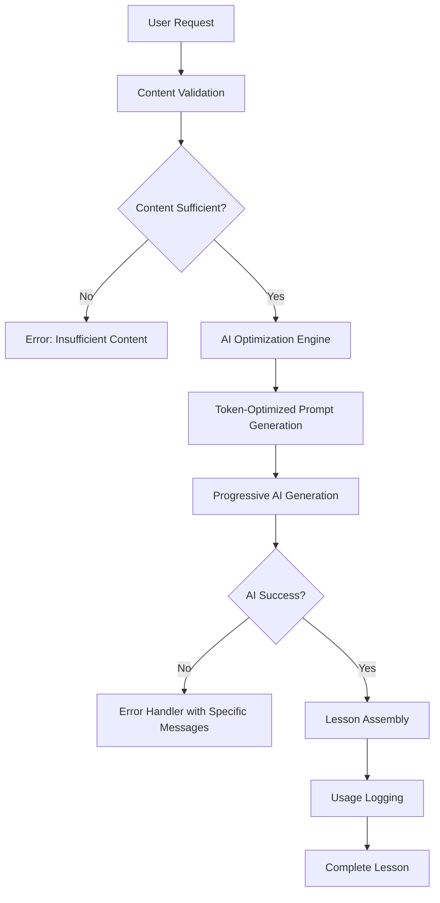

# Design Document: AI-Only Lesson Generation

## Overview

This feature transforms LinguaSpark from a hybrid AI/fallback system to a pure AI-driven lesson generation platform. The design eliminates all fallback content mechanisms and implements sophisticated AI optimization strategies to minimize token consumption while maintaining high-quality lesson output. The system will fail gracefully with clear error messaging rather than compromising the core value proposition with generic content.

## Architecture

### High-Level Architecture



### System Components

1. **Content Validation Layer**: Pre-validates source content before AI processing
2. **AI Optimization Engine**: Implements token reduction strategies
3. **Progressive Generation System**: Generates lessons section-by-section with shared context
4. **Error Classification System**: Provides specific, actionable error messages
5. **Usage Monitoring System**: Comprehensive logging and analytics

## Components and Interfaces

### 1. Content Validation Service

**Purpose**: Ensures source content meets minimum requirements for AI processing

```typescript
interface ContentValidator {
  validateContent(content: string): ValidationResult;
  getMinimumWordCount(): number;
  checkContentQuality(content: string): QualityScore;
}

interface ValidationResult {
  isValid: boolean;
  reason?: string;
  suggestions?: string[];
}
```

**Design Rationale**: Pre-validation prevents wasted AI calls and provides immediate feedback to users about content suitability.

### 2. AI Optimization Engine

**Purpose**: Implements token reduction strategies while maintaining lesson quality

```typescript
interface AIOptimizer {
  optimizePrompt(section: LessonSection, context: SharedContext): OptimizedPrompt;
  extractKeyTerms(content: string): string[];
  summarizeContent(content: string, maxLength: number): string;
  batchPrompts(prompts: Prompt[]): BatchedPrompt[];
}

interface OptimizedPrompt {
  prompt: string;
  estimatedTokens: number;
  optimizationStrategy: string;
}
```

**Design Rationale**: Centralized optimization allows for consistent token reduction across all lesson sections and enables A/B testing of different strategies.

### 3. Progressive Generation System

**Purpose**: Generates lessons incrementally with shared context to reduce redundancy

```typescript
interface ProgressiveGenerator {
  generateSection(
    section: LessonSection, 
    sharedContext: SharedContext,
    previousSections: GeneratedSection[]
  ): Promise<GeneratedSection>;
  
  buildSharedContext(content: string): SharedContext;
  updateContext(context: SharedContext, newSection: GeneratedSection): SharedContext;
}

interface SharedContext {
  keyVocabulary: string[];
  mainThemes: string[];
  difficultyLevel: CEFRLevel;
  contentSummary: string;
}
```

**Design Rationale**: Progressive generation with shared context prevents redundant AI calls and ensures consistency across lesson sections.

### 4. Error Classification System

**Purpose**: Provides specific, actionable error messages based on failure type

```typescript
interface ErrorClassifier {
  classifyError(error: AIError): ClassifiedError;
  generateUserMessage(error: ClassifiedError): UserErrorMessage;
  generateSupportMessage(error: ClassifiedError): SupportErrorMessage;
}

interface ClassifiedError {
  type: 'QUOTA_EXCEEDED' | 'CONTENT_ISSUE' | 'NETWORK_ERROR' | 'UNKNOWN';
  originalError: Error;
  context: ErrorContext;
  errorId: string;
}
```

**Design Rationale**: Specific error classification enables targeted user guidance and better debugging capabilities.

### 5. Usage Monitoring System

**Purpose**: Comprehensive logging for optimization and debugging

```typescript
interface UsageMonitor {
  logTokenUsage(section: string, tokens: number, optimization: string): void;
  logError(error: ClassifiedError, context: GenerationContext): void;
  logOptimizationSavings(baseline: number, optimized: number, strategy: string): void;
  generateUsageReport(): UsageReport;
}
```

## Data Models

### Lesson Generation Request

```typescript
interface LessonGenerationRequest {
  content: string;
  lessonType: LessonType;
  difficultyLevel: CEFRLevel;
  userId: string;
  optimizationPreferences?: OptimizationPreferences;
}
```

### Optimized Lesson Structure

```typescript
interface OptimizedLesson {
  id: string;
  sections: GeneratedSection[];
  metadata: LessonMetadata;
  usage: UsageMetrics;
  generationStrategy: OptimizationStrategy;
}

interface UsageMetrics {
  totalTokens: number;
  tokensPerSection: Record<string, number>;
  optimizationSavings: number;
  generationTime: number;
}
```

### Error Response Model

```typescript
interface ErrorResponse {
  success: false;
  error: {
    type: ErrorType;
    message: string;
    actionableSteps: string[];
    errorId: string;
    supportContact?: string;
  };
}
```

## Error Handling

### Error Classification Strategy

1. **Quota Exceeded**: API limits reached
   - Message: "API quota exceeded, please try again later"
   - Action: Suggest waiting or upgrading plan

2. **Content Issues**: Insufficient or inappropriate content
   - Message: "Unable to process this content, please try different text"
   - Action: Provide content guidelines

3. **Network Errors**: Connection or service issues
   - Message: "Connection error, please check your internet and try again"
   - Action: Retry mechanism with exponential backoff

4. **Unknown Errors**: Unexpected failures
   - Message: "AI service temporarily unavailable, please try again later"
   - Action: Generate support ticket with error ID

### Graceful Degradation Strategy

**Design Decision**: No fallback content will be provided. The system will always fail with clear messaging rather than compromise the AI-first value proposition.

**Rationale**: Maintaining product integrity is more important than availability. Users expect AI-generated content, and providing generic alternatives undermines trust and product differentiation.

## Testing Strategy

### Unit Testing

1. **Content Validation Tests**
   - Test minimum content requirements
   - Test content quality scoring
   - Test edge cases (empty, very short, non-text content)

2. **AI Optimization Tests**
   - Test token reduction strategies
   - Test prompt optimization effectiveness
   - Test batching logic

3. **Error Classification Tests**
   - Test error type detection
   - Test message generation
   - Test error ID generation

### Integration Testing

1. **End-to-End Generation Flow**
   - Test complete lesson generation with optimization
   - Test error handling across all failure points
   - Test usage logging accuracy

2. **AI Service Integration**
   - Test with actual Google AI APIs
   - Test quota handling
   - Test network failure scenarios

### Performance Testing

1. **Token Optimization Validation**
   - Measure token reduction percentages
   - Compare generation quality before/after optimization
   - Test generation speed improvements

2. **Error Response Time**
   - Measure time to error detection
   - Test user experience during failures

## Implementation Phases

### Phase 1: Remove Fallback Content
- Remove all template/fallback lesson content
- Implement basic error handling with generic messages
- Update UI to handle AI-only responses

### Phase 2: Implement AI Optimization
- Build content validation layer
- Implement token optimization strategies
- Add progressive generation system

### Phase 3: Enhanced Error Handling
- Implement error classification system
- Add specific error messages and actions
- Build usage monitoring and logging

### Phase 4: Optimization and Monitoring
- Add comprehensive usage analytics
- Implement optimization A/B testing
- Build performance monitoring dashboard

## Security Considerations

1. **API Key Protection**: Ensure Google AI API keys are properly secured
2. **Content Sanitization**: Validate and sanitize user content before AI processing
3. **Error Information Leakage**: Ensure error messages don't expose sensitive system information
4. **Usage Logging Privacy**: Log usage metrics without exposing user content

## Performance Considerations

1. **Token Optimization Targets**:
   - 30-50% reduction in token usage per lesson
   - Maintain generation quality above 90% user satisfaction
   - Keep generation time under 30 seconds per lesson

2. **Caching Strategy**:
   - Cache optimized prompts for similar content types
   - Cache vocabulary extractions for common domains
   - Implement intelligent cache invalidation

3. **Rate Limiting**:
   - Implement client-side rate limiting to prevent quota exhaustion
   - Add queue system for high-demand periods
   - Provide usage feedback to users

## Monitoring and Analytics

1. **Key Metrics**:
   - Token usage per lesson section
   - Optimization savings percentage
   - Error rates by type
   - User satisfaction with AI-only approach

2. **Alerting**:
   - High error rates
   - Quota approaching limits
   - Unusual token consumption patterns
   - System performance degradation

This design ensures LinguaSpark maintains its AI-first value proposition while implementing sophisticated optimization strategies to maximize efficiency and provide excellent user experience even when AI generation fails.