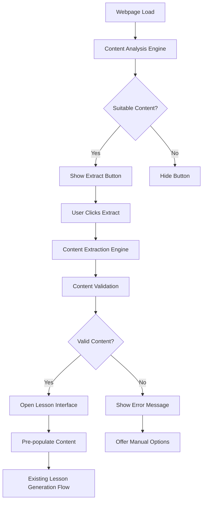

# Design Document: Extract from Page Button Feature

## Overview

This feature adds a visible "Extract from Page" button to webpages that allows users to directly extract content and generate lessons without manual copy-pasting. The design integrates with the existing Chrome extension architecture while adding intelligent content detection, a floating action button UI, and seamless integration with the current lesson generation workflow. The solution prioritizes user experience, privacy, and cross-site compatibility while maintaining the existing lesson quality standards.

## Architecture

### High-Level Architecture



### System Components

1. **Content Analysis Engine**: Analyzes webpage content to determine button visibility
2. **Floating Action Button**: Responsive UI component that appears on suitable pages
3. **Content Extraction Engine**: Enhanced version of existing extraction with validation
4. **Lesson Interface Bridge**: Connects extracted content to existing lesson generation
5. **Privacy Manager**: Ensures data handling compliance and user privacy

## Components and Interfaces

### 1. Content Analysis Engine

**Purpose**: Analyzes webpages in real-time to determine if the extract button should be displayed

```typescript
interface ContentAnalysisEngine {
  analyzePageContent(): ContentAnalysisResult;
  isContentSuitable(analysis: ContentAnalysisResult): boolean;
  detectContentType(content: string): ContentType;
  calculateContentQuality(content: string): QualityScore;
  detectLanguage(content: string): LanguageDetectionResult;
  excludeSocialMediaContent(content: string): boolean;
}

interface ContentAnalysisResult {
  wordCount: number;
  contentType: ContentType;
  language: string;
  languageConfidence: number;
  qualityScore: number;
  hasMainContent: boolean;
  isEducational: boolean;
  advertisingRatio: number;
  hasSocialMediaFeeds: boolean;
  hasCommentSections: boolean;
}

interface LanguageDetectionResult {
  language: string;
  confidence: number;
  isSupported: boolean;
}

interface QualityScore {
  readability: number;
  structure: number;
  length: number;
  overall: number;
}

type ContentType = 'article' | 'blog' | 'news' | 'tutorial' | 'encyclopedia' | 'product' | 'social' | 'navigation' | 'ecommerce' | 'multimedia' | 'other';
```

**Design Rationale**: Real-time analysis ensures the button only appears on suitable pages, reducing user confusion and improving the experience. Quality scoring helps filter out low-value content. Language detection ensures compatibility with supported languages only.

**Analysis Criteria** (Requirement 2):
- Minimum 100 words of readable text (Requirements 1.2, 2.3)
- Content-to-advertising ratio > 60%
- Presence of structured content (headings, paragraphs)
- Educational content indicators (articles, tutorials, news, blogs) (Requirement 2.1)
- Supported language detection with confidence threshold (Requirement 2.4)
- Exclusion of e-commerce and multimedia-focused pages (Requirement 2.2)
- Exclusion of social media feeds and comment sections (Requirement 2.5)

### 2. Floating Action Button Component

**Purpose**: Provides a non-intrusive, accessible button that integrates with any webpage design

```typescript
interface DraggableFloatingButton {
  show(): void;
  hide(): void;
  startDrag(event: MouseEvent | TouchEvent): void;
  handleDrag(event: MouseEvent | TouchEvent): void;
  endDrag(): void;
  snapToEdge(): void;
  handleClick(): void;
  setLoadingState(loading: boolean): void;
  setProgressState(progress: number): void;
  showError(message: string): void;
  showSuccess(): void;
  enableKeyboardNavigation(): void;
  savePosition(): void;
  loadSavedPosition(): void;
  playMascotAnimation(type: MascotAnimationType): void;
}

interface ButtonConfiguration {
  initialPosition: { x: number; y: number };
  size: 'small' | 'medium' | 'large';
  theme: 'light' | 'dark' | 'auto';
  zIndex: number;
  dragEnabled: boolean;
  snapToEdges: boolean;
  touchFriendly: boolean;
  keyboardShortcut: string;
  mascotEnabled: boolean;
  animationSpeed: 'slow' | 'normal' | 'fast';
}

interface ButtonState {
  visible: boolean;
  loading: boolean;
  progress: number;
  disabled: boolean;
  error: string | null;
  success: boolean;
  isDragging: boolean;
  position: { x: number; y: number };
  currentAnimation: MascotAnimationType | null;
}

interface MascotAnimations {
  idle: () => void;
  hover: () => void;
  click: () => void;
  loading: () => void;
  success: () => void;
  error: () => void;
  drag: () => void;
}

type MascotAnimationType = 'idle' | 'hover' | 'click' | 'loading' | 'success' | 'error' | 'drag';

interface AccessibilityFeatures {
  ariaLabel: string;
  ariaDescription: string;
  keyboardShortcut: string;
  screenReaderAnnouncements: boolean;
  highContrastSupport: boolean;
  dragInstructions: string;
}
```

**Design Rationale**: A draggable floating button with mascot provides consistent visibility while giving users control over placement. The mascot "Sparky" adds personality and provides visual feedback, making the extraction process more engaging and intuitive.

### Sparky Mascot Design

**Character Concept**: Sparky is a friendly lightning bolt character that represents the "spark" of inspiration when transforming web content into lessons.

**Visual Design**:
- Main body: Electric blue lightning bolt shape (#2563eb)
- Eyes: Large, expressive white circles with black pupils
- Mouth: Simple curved line that changes with emotions
- Accent: Yellow/gold spark effects around the edges (#fbbf24)
- Size: Scales proportionally with button size

**Animation States**:
```typescript
interface SparkyAnimations {
  idle: {
    duration: 3000;
    effects: ['gentle_glow', 'occasional_blink', 'subtle_float'];
  };
  hover: {
    duration: 500;
    effects: ['excited_bounce', 'eye_sparkle', 'increased_glow'];
  };
  click: {
    duration: 200;
    effects: ['quick_flash', 'eye_wink', 'spark_burst'];
  };
  loading: {
    duration: 'infinite';
    effects: ['spinning_sparks', 'pulsing_glow', 'determined_expression'];
  };
  success: {
    duration: 2000;
    effects: ['celebration_bounce', 'happy_eyes', 'confetti_sparks'];
  };
  error: {
    duration: 1500;
    effects: ['sad_droop', 'concerned_eyes', 'dim_glow'];
  };
  dragging: {
    duration: 'while_dragging';
    effects: ['trail_sparks', 'focused_eyes', 'slight_tilt'];
  };
}
```

**Personality Traits**:
- Enthusiastic about learning and content
- Helpful and encouraging
- Slightly mischievous (occasional playful animations)
- Responsive to user interactions

**UI Specifications** (Requirements 1, 7):
- **Draggable Position**: Starts in bottom-right corner by default, but users can drag it anywhere on screen (Requirement 1.3)
- **Smart Positioning**: Remembers user's preferred position per domain and snaps to screen edges
- **Mascot Design**: Features "Sparky" - a friendly lightning bolt character with animated expressions
- **Size**: 64px diameter on desktop, 56px on mobile for touch-friendly dragging (Requirement 7.4)
- **Colors**: LinguaSpark brand colors (electric blue #2563eb) with high contrast white/yellow accents (Requirement 1.4)
- **Animations**: 
  - Sparky blinks and looks around when idle
  - Excited bounce animation when hovering
  - Lightning spark effects during extraction
  - Smooth drag animations with physics-based momentum
  - Celebration animation on successful extraction
- **Accessibility**: ARIA labels, keyboard navigation support, screen reader compatibility (Requirements 1.5, 7.5, 7.6)
- **Responsive Design**: Adapts size and touch targets for different screen sizes (Requirement 7.3)
- **Persistent Visibility**: Stays visible during page scroll, with smart collision detection to avoid page elements (Requirement 1.6)

### 3. Enhanced Content Extraction Engine

**Purpose**: Builds upon existing extraction with improved accuracy and validation

```typescript
interface EnhancedContentExtractor {
  extractPageContent(): Promise<ExtractedContent>;
  validateContent(content: ExtractedContent): ValidationResult;
  cleanContent(rawContent: string): string;
  extractMetadata(): ContentMetadata;
  removeNonContentElements(document: Document): Document;
  preserveStructuredContent(content: string): StructuredContent;
  suggestLessonType(content: ExtractedContent): LessonType;
}

interface ExtractedContent {
  text: string;
  structuredContent: StructuredContent;
  metadata: ContentMetadata;
  quality: ContentQuality;
  sourceInfo: SourceInfo;
  suggestedLessonType: LessonType;
  suggestedCEFRLevel: CEFRLevel;
}

interface ContentMetadata {
  title: string;
  author?: string;
  publicationDate?: Date;
  sourceUrl: string;
  domain: string;
  description?: string;
  keywords?: string[];
}

interface ValidationResult {
  isValid: boolean;
  meetsMinimumQuality: boolean;
  issues: ValidationIssue[];
  warnings: string[];
  recommendations: string[];
}

interface ValidationIssue {
  type: 'insufficient_content' | 'poor_quality' | 'unsupported_language' | 'extraction_failed';
  message: string;
  severity: 'error' | 'warning';
  suggestedAction: string;
}

interface ContentQuality {
  wordCount: number;
  readingTime: number;
  complexity: 'beginner' | 'intermediate' | 'advanced';
  suitabilityScore: number;
  issues: string[];
  meetsMinimumStandards: boolean;
}

interface SourceInfo {
  url: string;
  domain: string;
  title: string;
  extractedAt: Date;
  userAgent: string;
  attribution: string;
}

type LessonType = 'discussion' | 'grammar' | 'travel' | 'business' | 'pronunciation';
type CEFRLevel = 'A1' | 'A2' | 'B1' | 'B2' | 'C1';
```

**Design Rationale**: Enhanced extraction improves upon the existing content.js functionality with better content validation and quality assessment. Automatic lesson type and CEFR level suggestion streamlines the user workflow.

**Extraction Improvements** (Requirement 3):
- Better content area detection using multiple strategies
- Improved removal of navigation, advertisements, headers, footers (Requirement 3.2)
- Structured content preservation (headings, lists, quotes) (Requirement 3.3)
- Comprehensive metadata extraction including title, author, publication date, source URL (Requirement 3.4)
- Content quality validation with minimum standards enforcement (Requirement 3.5)
- Automatic lesson type suggestion based on content analysis (Requirement 4.3)
- CEFR level recommendation based on content complexity

### 4. Lesson Interface Bridge

**Purpose**: Seamlessly connects extracted content to the existing lesson generation interface

```typescript
interface LessonInterfaceBridge {
  openLessonInterface(content: ExtractedContent): Promise<void>;
  populateInterface(content: ExtractedContent): void;
  enableContentEditing(): void;
  preserveUserCustomizations(): void;
  integrateWithExistingWorkflow(): void;
  showExtractionConfirmation(content: ExtractedContent): Promise<boolean>;
}

interface LessonPreConfiguration {
  sourceContent: string;
  suggestedType: LessonType;
  suggestedLevel: CEFRLevel;
  metadata: ContentMetadata;
  extractionSource: 'webpage';
  allowContentEditing: boolean;
  userCanModifySettings: boolean;
  attribution: string;
}

interface InterfaceState {
  contentPrePopulated: boolean;
  settingsCustomizable: boolean;
  extractionConfirmed: boolean;
  readyForGeneration: boolean;
}
```

**Design Rationale**: The bridge ensures extracted content integrates smoothly with existing lesson generation without requiring changes to the core generation logic. User control and customization remain paramount.

**Integration Points** (Requirement 4):
- Open LinguaSpark lesson generation interface automatically (Requirement 4.1)
- Pre-populate source content field with extracted content (Requirement 4.2)
- Pre-select appropriate lesson type based on content analysis (Requirement 4.3)
- Allow user modification of lesson type, CEFR level, and other settings (Requirement 4.4)
- Enable content editing before generation (Requirement 4.5)
- Integrate with existing enhanced lesson generation workflow (Requirement 4.6)
- Maintain extraction metadata for lesson attribution
- Show extraction confirmation before proceeding (Requirement 5.6)

### 5. Privacy Manager

**Purpose**: Ensures user privacy and data protection compliance

```typescript
interface PrivacyManager {
  canExtractFromDomain(domain: string): boolean;
  sanitizeContent(content: string): string;
  respectRobotsTxt(url: string): Promise<boolean>;
  logDataUsage(action: string, dataSize: number): void;
  ensureExplicitUserConsent(): boolean;
  limitDataCollection(): void;
  enforceSessionOnlyStorage(): void;
  includeProperAttribution(content: ExtractedContent): string;
}

interface PrivacySettings {
  respectRobotsTxt: boolean;
  excludeDomains: string[];
  maxContentSize: number;
  dataRetentionHours: number;
  explicitConsentRequired: boolean;
  sessionOnlyStorage: boolean;
  includeAttribution: boolean;
}

interface DataHandlingPolicy {
  extractOnlyOnUserRequest: boolean;
  noAnalysisDataStorage: boolean;
  noContentTransmissionDuringAnalysis: boolean;
  sessionLimitedStorage: boolean;
  respectTermsOfService: boolean;
  includeSourceAttribution: boolean;
}
```

**Design Rationale**: Privacy management ensures compliance with website terms and user expectations while maintaining functionality. Explicit user consent and minimal data collection principles are enforced.

**Privacy Compliance** (Requirement 6):
- Extract content only when user explicitly clicks the button (Requirement 6.1)
- No storage or transmission of page content during analysis (Requirement 6.2)
- Process only content necessary for lesson generation (Requirement 6.3)
- No storage of extracted content beyond lesson generation session (Requirement 6.4)
- Respect website robots.txt and terms of service (Requirement 6.5)
- Include proper attribution and source URL in generated lessons (Requirement 6.6)

## Data Models

### Button Visibility Decision

```typescript
interface ButtonVisibilityDecision {
  shouldShow: boolean;
  reason: string;
  contentAnalysis: ContentAnalysisResult;
  timestamp: Date;
}
```

### Extraction Session

```typescript
interface ExtractionSession {
  sessionId: string;
  sourceUrl: string;
  startTime: Date;
  endTime?: Date;
  status: 'started' | 'extracting' | 'validating' | 'complete' | 'failed';
  extractedContent?: ExtractedContent;
  error?: string;
}
```

### User Interaction Event

```typescript
interface UserInteractionEvent {
  eventType: 'button_shown' | 'button_clicked' | 'extraction_started' | 'extraction_completed' | 'lesson_opened';
  timestamp: Date;
  url: string;
  sessionId: string;
  metadata?: Record<string, any>;
}
```

## User Interface Design

### Floating Action Button

**Visual Design**:
- Circular button with LinguaSpark logo
- Primary brand color (#4F46E5) with white icon
- Drop shadow for depth and visibility
- Smooth animations for state changes

**States**:
- **Default**: Solid color with extract icon
- **Hover**: Slight scale increase and shadow enhancement
- **Loading**: Spinning animation with progress indicator
- **Error**: Red color with error icon, tooltip with message
- **Success**: Green checkmark, brief confirmation before transition

**Positioning Logic**:
```typescript
const calculatePosition = (viewport: Viewport, pageContent: PageContent) => {
  const defaultPosition = { bottom: '20px', right: '20px' };
  
  // Avoid overlapping with page elements
  if (hasFixedElements(pageContent)) {
    return adjustForFixedElements(defaultPosition, pageContent);
  }
  
  // Adapt to mobile viewports
  if (viewport.width < 768) {
    return { bottom: '80px', right: '16px' }; // Above mobile browser UI
  }
  
  return defaultPosition;
};
```

### Loading and Feedback States

**Loading Sequence with Sparky** (Requirement 5):
1. **Click Response**: Sparky winks and flashes, button shows immediate feedback (Requirement 5.1)
2. **Extraction Phase**: Sparky spins with determined expression, tooltip shows "Sparky is extracting content..." (Requirement 5.2)
3. **Progress Animation**: Lightning sparks circle around Sparky, intensity increases with progress
4. **Completion**: Success celebration with bouncing Sparky or sad Sparky for errors (Requirements 5.3, 5.6)

**Sparky's Feedback Animations** (Requirement 5):
- **Success**: Sparky bounces excitedly with confetti sparks and happy eyes
- **Error**: Sparky droops sadly with dim glow and concerned expression (Requirement 5.3)
- **Retry**: Sparky perks up hopefully when "Try Again" is available (Requirement 5.4)
- **Warning**: Sparky shows cautious expression with amber glow for insufficient content (Requirement 5.5)
- **Help**: Sparky points toward help documentation with helpful gesture

**Interactive Progress States**:
- **Analyzing** (0-20%): Sparky's eyes dart around, scanning animation
- **Extracting** (20-60%): Sparky glows brighter, pulling motion with sparks
- **Cleaning** (60-80%): Sparky spins gently, polishing animation
- **Preparing** (80-100%): Sparky builds up energy, anticipation animation
- **Success**: Sparky celebrates with firework-like spark explosion

**Dragging Feedback**:
- **Drag Start**: Sparky's eyes focus, slight forward lean
- **Dragging**: Trail of small sparks follows movement
- **Snap to Edge**: Sparky looks satisfied, small spark burst
- **Position Saved**: Sparky gives thumbs up (lightning bolt thumbs up)

## Content Analysis Strategy

### Page Suitability Algorithm

```typescript
const analyzePage = (document: Document): ContentAnalysisResult => {
  const content = extractTextContent(document);
  const wordCount = countWords(content);
  const contentType = detectContentType(document);
  const structure = analyzeStructure(document);
  const language = detectLanguage(content);
  
  const qualityScore = calculateQualityScore({
    wordCount,
    structure,
    contentType,
    advertisingRatio: calculateAdRatio(document)
  });
  
  return {
    wordCount,
    contentType,
    language,
    qualityScore,
    hasMainContent: structure.hasMainContent,
    isEducational: isEducationalContent(contentType, content),
    advertisingRatio: calculateAdRatio(document)
  };
};
```

**Quality Scoring Factors**:
- Word count (minimum 100, optimal 500-2000)
- Content structure (headings, paragraphs, lists)
- Content type (articles/blogs score higher than product pages)
- Advertising ratio (lower is better)
- Language detection confidence
- Readability metrics

### Content Type Detection

**Detection Strategies**:
1. **URL Analysis**: Check for `/blog/`, `/article/`, `/news/`, `/wiki/` patterns
2. **Meta Tags**: Analyze `og:type`, `article:*` meta properties
3. **Structured Data**: Look for JSON-LD article markup
4. **Content Patterns**: Analyze text structure and publishing indicators
5. **Domain Classification**: Maintain list of known educational domains

## Integration with Existing Systems

### Chrome Extension Architecture

**Manifest Updates**:
- No additional permissions required
- Leverage existing content script injection
- Use existing storage and messaging APIs

**Content Script Enhancement**:
```typescript
// Enhanced content.js
class ExtractFromPageFeature {
  private analysisEngine: ContentAnalysisEngine;
  private extractionEngine: EnhancedContentExtractor;
  private floatingButton: FloatingActionButton;
  
  async initialize() {
    await this.analyzeCurrentPage();
    if (this.shouldShowButton()) {
      this.showFloatingButton();
    }
  }
  
  private async handleExtractClick() {
    try {
      this.floatingButton.setLoadingState(true);
      const content = await this.extractionEngine.extractPageContent();
      const validation = await this.extractionEngine.validateContent(content);
      
      if (validation.isValid) {
        await this.openLessonInterface(content);
      } else {
        this.showValidationError(validation.issues);
      }
    } catch (error) {
      this.handleExtractionError(error);
    } finally {
      this.floatingButton.setLoadingState(false);
    }
  }
}
```

### Lesson Generation Integration

**Interface Bridge Implementation** (Requirement 4):
```typescript
const openLessonInterface = async (content: ExtractedContent) => {
  // Show extraction confirmation (Requirement 5.6)
  const confirmed = await showExtractionConfirmation(content);
  if (!confirmed) return;
  
  // Store extracted content in extension storage (Requirement 4.2)
  await chrome.storage.local.set({
    extractedContent: content,
    extractionSource: 'webpage',
    extractionTimestamp: Date.now(),
    suggestedLessonType: content.suggestedLessonType, // Requirement 4.3
    suggestedCEFRLevel: content.suggestedCEFRLevel,
    allowEditing: true, // Requirement 4.5
    attribution: content.sourceInfo.attribution // Requirement 6.6
  });
  
  // Open lesson generation interface (Requirement 4.1)
  if (chrome.action && chrome.action.openPopup) {
    await chrome.action.openPopup();
  } else {
    // Fallback: open in new tab with lesson interface
    await chrome.tabs.create({
      url: chrome.runtime.getURL('popup.html?source=extraction&autoPopulate=true')
    });
  }
  
  // Integrate with existing enhanced lesson generation workflow (Requirement 4.6)
  // The popup will detect the extraction source and auto-populate accordingly
};

const showExtractionConfirmation = async (content: ExtractedContent): Promise<boolean> => {
  return new Promise((resolve) => {
    // Show confirmation dialog with content preview
    const confirmationDialog = createConfirmationDialog({
      title: 'Content Extracted Successfully',
      preview: content.text.substring(0, 100) + '...',
      wordCount: content.quality.wordCount,
      suggestedType: content.suggestedLessonType,
      source: content.sourceInfo.title,
      onConfirm: () => resolve(true),
      onCancel: () => resolve(false)
    });
    
    document.body.appendChild(confirmationDialog);
  });
};
```

## Error Handling and Edge Cases

### Common Error Scenarios (Requirement 5)

1. **Insufficient Content** (Requirement 5.5)
   - Show message: "This page doesn't have enough content for lesson generation (minimum 100 words required)"
   - Offer manual selection option with guidance
   - Suggest minimum content requirements and examples
   - Provide "Select Text Manually" fallback option

2. **Content Extraction Failure** (Requirement 5.3)
   - Show message: "Unable to extract content from this page due to [specific reason]"
   - Provide "Try Again" button for recoverable errors (Requirement 5.4)
   - Offer manual copy-paste fallback (Requirement 5.4)
   - Include troubleshooting tips for common issues

3. **Network/API Errors**
   - Show message: "Connection error. Please check your internet connection and try again."
   - Implement retry logic with exponential backoff
   - Cache extracted content for retry attempts
   - Provide offline guidance when possible

4. **Unsupported Content Type** (Requirements 2.1, 2.2)
   - Show message: "This type of content isn't suitable for lessons (detected: [content type])"
   - Explain what content works best (articles, blogs, news, tutorials)
   - Provide examples of suitable pages
   - Suggest alternative content sources

5. **Language Detection Issues** (Requirement 2.4)
   - Show message: "Content language not supported or could not be detected"
   - List supported languages
   - Offer manual language selection option
   - Provide guidance on language requirements

### Edge Case Handling

**Dynamic Content Pages**:
- Wait for content to load before analysis
- Re-analyze after significant DOM changes
- Handle single-page applications (SPAs)

**Protected/Restricted Content**:
- Respect robots.txt directives
- Handle login-required pages gracefully
- Skip pages with anti-scraping measures

**Performance Considerations**:
- Throttle analysis on rapid page changes
- Cache analysis results for recently visited pages
- Optimize DOM queries for large pages

## Security Considerations

### Content Security Policy (CSP)

**CSP Compliance**:
- Use inline styles sparingly, prefer CSS classes
- Avoid eval() and inline JavaScript
- Use nonce-based script loading where required

**Cross-Origin Restrictions**:
- Respect CORS policies
- Handle iframe restrictions
- Work within extension security model

### Data Protection

**Privacy by Design**:
- Only extract content when explicitly requested
- Don't store extracted content beyond session
- Minimize data collection and transmission
- Provide clear privacy controls

**Security Measures**:
- Sanitize extracted content before processing
- Validate all user inputs
- Use secure communication channels
- Implement rate limiting for extraction requests

## Performance Optimization

### Efficient Content Analysis

**Optimization Strategies**:
- Use lightweight DOM queries
- Implement debounced analysis for dynamic pages
- Cache analysis results for performance
- Use Web Workers for heavy computation when possible

**Memory Management**:
- Clean up event listeners on page unload
- Limit cached data size
- Use weak references where appropriate
- Implement garbage collection for old sessions

### Network Optimization

**Bandwidth Considerations**:
- Compress extracted content before transmission
- Implement request batching where possible
- Use efficient serialization formats
- Minimize API calls through caching

## Testing Strategy

### Unit Testing

1. **Content Analysis Engine**
   - Test page suitability detection with various page types
   - Verify quality scoring accuracy
   - Test language detection reliability

2. **Content Extraction Engine**
   - Test extraction accuracy on different site layouts
   - Verify content cleaning effectiveness
   - Test metadata extraction completeness

3. **Floating Button Component**
   - Test positioning logic across viewport sizes
   - Verify accessibility compliance
   - Test state management and animations

### Integration Testing

1. **End-to-End Extraction Flow**
   - Test complete flow from button click to lesson interface
   - Verify content preservation through the pipeline
   - Test error handling and recovery

2. **Cross-Site Compatibility**
   - Test on major news sites (BBC, CNN, Reuters)
   - Test on educational sites (Wikipedia, Khan Academy)
   - Test on blog platforms (Medium, WordPress)
   - Test on documentation sites (MDN, GitHub)

3. **Browser Compatibility**
   - Test across Chrome versions
   - Test on different screen sizes and resolutions
   - Test with various browser extensions installed

### Performance Testing

1. **Analysis Performance**
   - Measure analysis time on large pages
   - Test memory usage during analysis
   - Verify no impact on page load performance

2. **Extraction Performance**
   - Measure extraction time for different content sizes
   - Test concurrent extraction requests
   - Verify cleanup after extraction completion

### User Experience Testing

1. **Usability Testing**
   - Test button discoverability
   - Verify intuitive interaction flow
   - Test error message clarity

2. **Accessibility Testing**
   - Test keyboard navigation
   - Verify screen reader compatibility
   - Test high contrast mode support

## Deployment and Rollout Strategy

### Phased Rollout

**Phase 1: Core Functionality**
- Basic button display and content extraction
- Integration with existing lesson generation
- Essential error handling

**Phase 2: Enhanced Features**
- Advanced content analysis
- Improved UI/UX
- Performance optimizations

**Phase 3: Polish and Optimization**
- Advanced accessibility features
- Cross-browser compatibility
- Analytics and monitoring

### Feature Flags

**Configurable Features**:
- Button visibility thresholds
- Content analysis sensitivity
- UI positioning and styling adapted to viewport size (Requirement 7.3)
- Privacy settings
- Accessibility preferences (Requirements 7.5, 7.6)
- Keyboard shortcut customization
- Touch-friendly sizing for mobile devices (Requirement 7.4)

**Cross-Browser Compatibility** (Requirement 7):
- Full feature support for Chrome browser (Requirement 7.1)
- Compatibility with other Chromium-based browsers (Requirement 7.2)
- Responsive design for different screen sizes (Requirement 7.3)
- Touch-friendly interface for mobile devices (Requirement 7.4)
- Keyboard navigation support with shortcuts (Requirement 7.5)
- Screen reader compatibility with proper ARIA labels (Requirement 7.6)

### Monitoring and Analytics

**Key Metrics**:
- Button display frequency
- Click-through rates
- Extraction success rates
- User satisfaction scores
- Performance metrics

**Error Tracking**:
- Extraction failure rates by site type
- Common error patterns
- Performance bottlenecks
- User abandonment points

## Future Enhancements

### Advanced Features

1. **Smart Content Selection**
   - Allow users to select specific page sections
   - Highlight extractable content areas
   - Support for multi-page article extraction

2. **Content Preprocessing**
   - Automatic content summarization
   - Key concept extraction
   - Difficulty level pre-assessment

3. **Batch Processing**
   - Extract from multiple tabs simultaneously
   - Bookmark pages for later extraction
   - Scheduled extraction for updated content

### Integration Opportunities

1. **Browser Integration**
   - Native browser context menu integration
   - Keyboard shortcut support
   - Integration with browser reading mode

2. **Third-Party Integrations**
   - LMS platform integration
   - Cloud storage sync
   - Collaboration features for team lesson planning

## Design Rationale Summary

This design enhances LinguaSpark's usability by eliminating the manual copy-paste step while maintaining the existing lesson generation quality. The floating action button approach provides consistent access without disrupting the browsing experience. The intelligent content analysis ensures the feature only appears when valuable, reducing user confusion.

Key design decisions prioritize:
1. **User Experience**: One-click extraction with clear feedback
2. **Privacy**: Minimal data collection with explicit user consent
3. **Compatibility**: Works across diverse website layouts and designs
4. **Performance**: Lightweight analysis with efficient extraction
5. **Integration**: Seamless connection to existing lesson generation workflow

The modular architecture allows for incremental development and future enhancements while maintaining system stability and user trust.
#
# Enhanced Technical Implementation

### Draggable Sparky Button System

The draggable Sparky button represents a significant enhancement to the user experience, transforming a simple floating action button into an interactive, personalized mascot that users can position according to their preferences.

**Key Features**:
- **Draggable Positioning**: Users can drag Sparky anywhere on the screen
- **Smart Position Memory**: Remembers preferred position per domain
- **Physics-Based Movement**: Momentum and elastic snapping for natural feel
- **Mascot Animations**: Sparky responds to user interactions with personality
- **Accessibility**: Full keyboard navigation and screen reader support

**Sparky Character Design**:
- **Visual**: Lightning bolt shape with gradient colors (#fbbf24 to #d97706)
- **Eyes**: Expressive animated eyes that track user interactions
- **Mouth**: Changes expression based on current state (happy, loading, error)
- **Spark Effects**: Dynamic particle effects during interactions

**Animation States**:
- **Idle**: Gentle floating with occasional blinks and looks around
- **Hover**: Excited bounce with sparkling eyes
- **Drag**: Focused expression with trailing spark effects
- **Loading**: Spinning with determined expression and pulsing glow
- **Success**: Celebration bounce with confetti-like spark burst
- **Error**: Sad droop with concerned expression and dimmed glow

**Technical Implementation Highlights**:
```typescript
// Smart positioning that avoids common UI elements
const getSmartDefaultPosition = (): { x: number; y: number } => {
  // Detects chat widgets, cookie banners, and other common elements
  // Automatically positions Sparky in an unobtrusive location
};

// Physics-based dragging with momentum
const applyMomentumAndSnap = (element: HTMLElement, velocity: { x: number; y: number }) => {
  // Applies realistic physics for natural movement
  // Snaps to screen edges when close enough
  // Creates satisfying visual feedback
};

// Persistent positioning per domain
const savePosition = (position: { x: number; y: number }) => {
  // Saves user's preferred position for each website
  // Includes viewport size for responsive repositioning
  // Expires old positions automatically
};
```

This enhanced implementation transforms the extract button from a simple UI element into an engaging, interactive companion that makes the content extraction process more delightful and user-friendly.